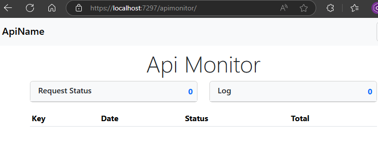
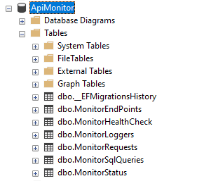
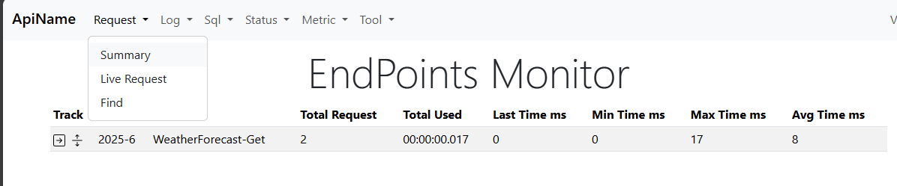
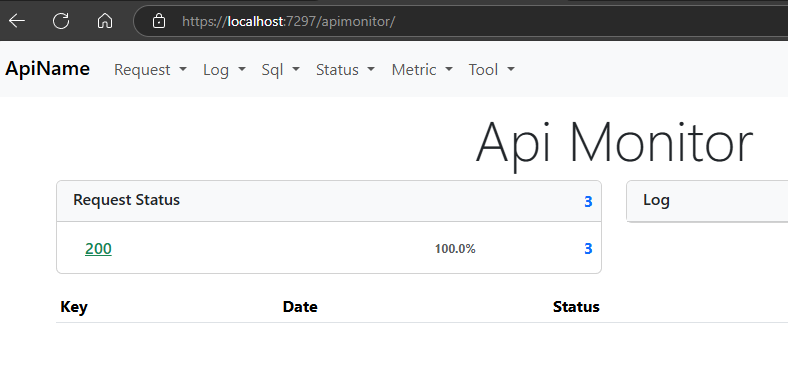
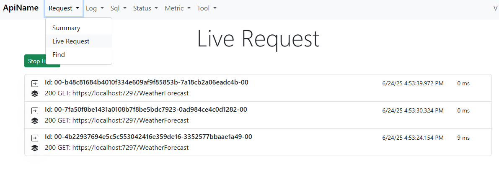
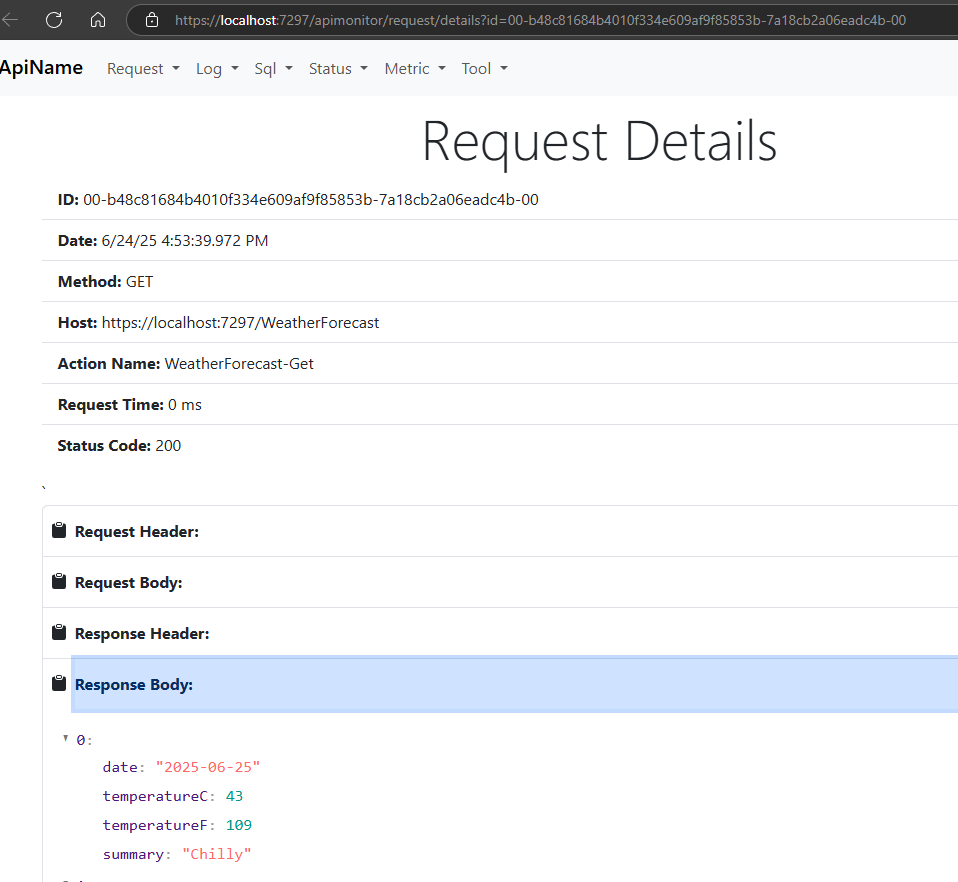
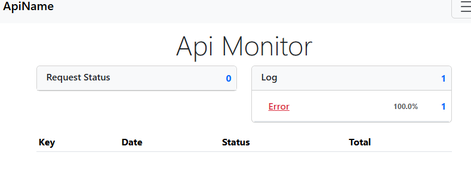
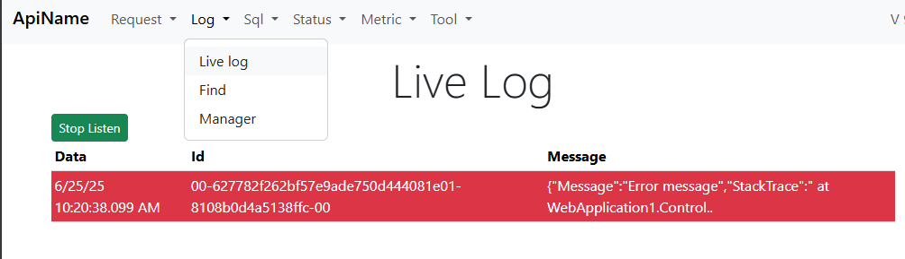
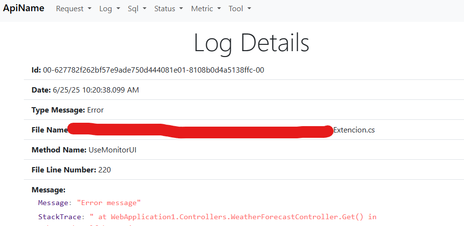

# ApiMonitor
ApiMonitor is a package that allows us to monitor the usage of our APIs Applications. Below is a description of each of the functionalities that it has available.
<!--TOC-->
  - [How to use it after installing the package](#How-to-use-it-after-installing-the-package)
    - [AutomaticMonitor](#AutomaticMonitor)
    - [AutomaticLogError](#AutomaticLogError)
  - [Getting Started with Client](#getting-started-with-client)
    - [Web Api Setting](#web-api-setting)
    - [Console App Setting](#console-app-setting)
<!--/TOC-->

## How to use it after installing the package

```C#
using ApiMonitorCore.Setting;

var builder = WebApplication.CreateBuilder(args);
builder.Services.AddControllers();
builder.Services.AddMonitor(builder.Configuration, new MonitorSetting()
{
    SqlSetting = new SqlSetting() { ConectionString = "Data Source=(localdb)\\MSSQLLocalDB;Initial Catalog=ApiMonitor;Integrated Security=True;Connect Timeout=30;Encrypt=False;Trust Server Certificate=False;Application Intent=ReadWrite;Multi Subnet Failover=False" },
    ApplicationName = "ApiName",
});
var app = builder.Build();
app.UseHttpsRedirection();
app.UseAuthorization();
app.UseMonitorUI(); //add Middleware
app.MapControllers();
app.Run();
```
With that configuration, it is enough to access the UI as shown in the picture. Just keep in mind that the database must be created first, all the tables will be created automatically.




In the Middleware **UseMonitorUI** you can use several overloads, to use **automaticLogError**, you must have email sending configured in **MonitorSetting** beforehand.


```C#
app.UseMonitorUI(); //Default
// or
app.UseMonitorUI(automaticMonitor : false, automaticLogError: true); // Default
```
## AutomaticMonitor
if the value is **true** it automatically monitors all the endpoints or can use the attribute [Monitor()] on top of the controller action We recommend that the **automaticMonitor** parameter be set to **false** and to use the **Monitor** attribute on the controller actions that we only want to monitor, as it also allows us to know what the request and the response of the call were.



```C#
// Program.cs
app.UseMonitorUI()

// WeatherForecastController.cs
[HttpGet(Name = "GetWeatherForecast")]
[Monitor(actionName:"",trackAction:true, historyDays:20)]
public IEnumerable<WeatherForecast> Get()
```

When the **trackAction** is **true**, it allows us to save the request and the response for a period of time in the database, and they can be viewed on the main screen and in the real-time request section.





## AutomaticLogError
if the value is **true** it automatically emits the error.

```C#
// WeatherForecastController.cs
[HttpGet(Name = "GetWeatherForecast")]
[Monitor(actionName:"",trackAction:true, historyDays:20)]
public IEnumerable<WeatherForecast> Get()
{
    throw new AggregateException("Error message"); // emit error

    return Enumerable.Range(1, 5).Select(index => new WeatherForecast
    {
        Date = DateOnly.FromDateTime(DateTime.Now.AddDays(index)),
        TemperatureC = Random.Shared.Next(-20, 55),
        Summary = Summaries[Random.Shared.Next(Summaries.Length)]
    })
    .ToArray();
}
```


